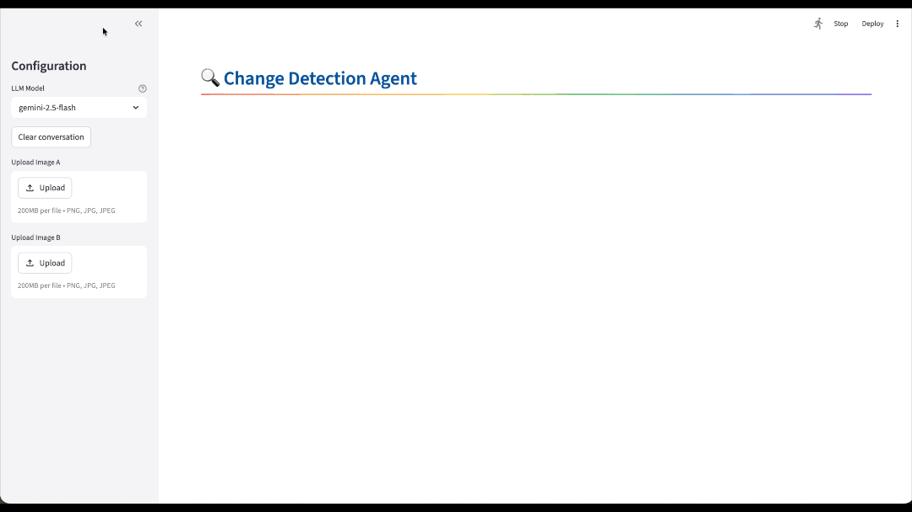

# ADK Change Detection Agent



A conversational AI agent for satellite imagery change detection, built with [Google ADK](https://google.github.io/adk-docs/) and Gemini.

## Files

| File | Description |
|------|-------------|
| `agent.py` | ADK agent with 4 tools wrapping the MCI change detection model |
| `app.py` | Streamlit chat UI for multi-turn interaction with the agent |
| `.env.example` | Configuration template — copy to `.env` and set your values |

## Quick Start

```bash
# From the repo root
cp src/adk_app/.env.example src/adk_app/.env
# Edit .env with your GCP project

cd src
streamlit run adk_app/app.py
```

## Agent Tools

| Tool | Purpose | Re-runs inference? |
|------|---------|--------------------|
| `set_image_paths` | Register before/after image paths | No |
| `detect_changes` | Run change detection: caption + mask + statistics | Yes |
| `get_last_statistics` | Retrieve cached stats from last detection | No |
| `save_road_change_map` | Save road-only change visualization | No |

## Configuration

All settings are in `.env`:

```env
# Google Cloud / Vertex AI
GOOGLE_GENAI_USE_VERTEXAI=TRUE
GOOGLE_CLOUD_PROJECT=your-gcp-project
GOOGLE_CLOUD_LOCATION=us-central1

# Gemini model
GEMINI_MODEL=gemini-2.5-flash
GEMINI_MODEL_OPTIONS=gemini-2.5-flash,gemini-2.5-pro

# MCI model (paths relative to src/)
MODEL_CHECKPOINT=./models_ckpt/MCI_model.pth
VOCAB_PATH=./data/LEVIR_MCI
GPU_ID=-1
```

## Example Conversation

1. Upload before/after images in the sidebar
2. *"What changed between these images?"* — agent runs detection + captioning
3. *"How many buildings?"* — agent returns cached statistics (no re-inference)
4. *"Save the road changes"* — agent extracts road-only mask
